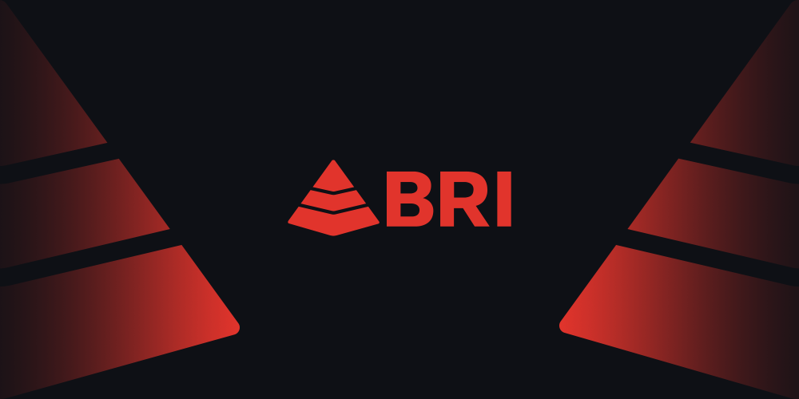

# Summary

Welcome to the go-to portal for in-depth information about the BRI (BRI) platform and ecosystem and how to interact with them!

The BRI documentation is separated into three major parts:

**1.** **BRI Docs**. This part is available in the sections below is for anyone who wants to learn more about BRI without going into detail that only developers would usually need to know.

**2.** **Developer docs.** Developers wishing to build on top of BRI and its mobile-centric infrastructure or run validator nodes should consult this [portal](https://developers.briscan.io).

**3. Tutorials.** This part contains various consumer-focused tutorials. It can be accessed here. \*\*\*\*


Join our [Telegram group]\
Or say hello at: support@briscan.io

